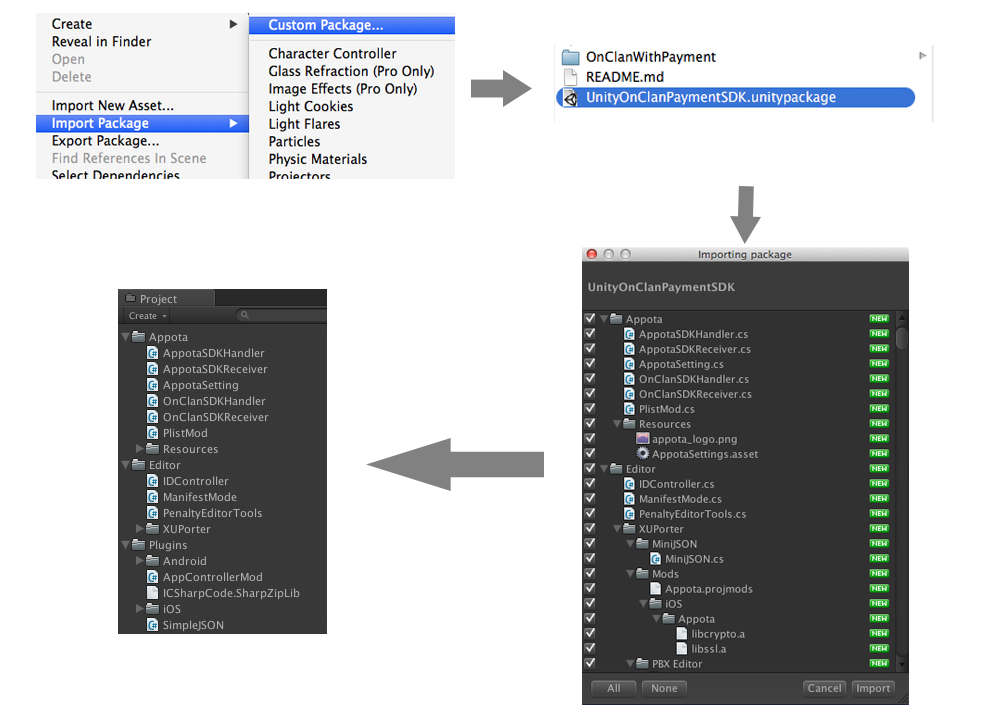

OnClanPaymentSDK Unity 
=========

Other Languages: [Tiếng Việt](README_vi.md)

**Steps to integrate OnClanPaymentSDK**

  - Import SDK into your project
  - Config SDK
  - Use SDK

Import SDK
---
Make sure you have the lastest UnityOnClanPaymentSDK.unitypackage. Open Unity, right click inside Tab Project and follow the instructions below.

 </br>


Bức ảnh cuối cùng hiển thị cấu trúc thư mục của OnClanPayment SDK. Bạn đã import thành công.

####iOS platform: 
To use the SDK for the iOS platform, you need to put all necessary frameworks in folder: Assets/Editor/XUPorter/Mods/iOS/Appota/ 

*List frameworks*:

In folder Frameworks/
> FacebookSDK.framework
>
> GoogleOpenSource.framework
>
> GooglePlus.bundle	
>
> GooglePlus.framework
>
> OnClanBundle.bundle
>
> OnClanSDK.framework
>
> AppotaBundle.bundle
>
> AppotaSDK.framework

Config SDK
---
**Config OnClan Setting**: To use OnClanPayment SDK features, you need to access menu Appota/Appota Setting to set the ID configurations.

 </br>

Cửa sổ Setting được hiện ra, ta cần điền đầy đủ thông tin cấu hình vào từng mục

 </br>

Configuration is divided into 3 separate sections:

#### OnClan Settings

- **Game ID**: is granted when register application on website http://developer.appota.com of Appota.
- **Api Key**: is granted when register application on website http://developer.appota.com of Appota.
- **Client ID**: Config on dev.appota.com 

#### Social Settings
- **Facebook ID**: is granted when register application on website developer of Facebook: https://developers.facebook.com/ (contact Appota Supporter to create Facebook application or you can create your own application as instructed by developer site). 

>  </br>
>
> **Note:** Configuration BundleID(iOS) or Package Name(Android) is declared on the page Developer must be match with Bundle Indentifier in Unity project.
>
>  </br>

- **Twitter Key**: is granted when register application on website https://dev.twitter.com/
- **Twitter Secret**: is granted when register application on website https://dev.twitter.com/

>  </br>
> 
> To be able to login Twitter, must config Callback URL.
>
>  </br>

- **Google Client ID**: is granted when register application on website https://developers.google.com/+/mobile/ (contact Appota Supporter to create Facebook application or you can create your own application as instructed by developer site).

>  </br>
>
> **Note:** Configuration BundleID(iOS) or Package Name(Android) is declared on the page Developer must be match with Bundle Indentifier in Unity project.
>
>  </br>

#### Payment Settings

- **PaymentState (optional)**: YOUR_PAYMENT_STATE
- **ConfigUrl**: URL to file config JSON
- **NoticeURL**: URL receiving notifications from Appota when incurring transaction.

File config JSON is created from tool https://developer.appota.com/sdktool.php<br/>

If you use Sandbox, you need to click to Using Sandbox. (iOS Platform: SANDBOX_INAPP_API_KEY will be use instead of ApiKey if Sandbox mode was active)

Select **Update Settings** after completing the ID Configuration.

Use SDK
---

####Initialize SDK
Before using SDK features, you need to call constructor function to config application:

```c#
public void Init();
```
*Usage*: This function is called when the game starts initializing, should be placed in Override method `Start()` or `Awake()` of Unity and just be called only once in game.
```c#
AppotaSDKHandler.Instance.Init();
```
####Payment Function
Using functions of class AppotaSDKHandler to implement next features:<br/>
```c#
void ShowLoginView(): method show form Login.
void SetAutoShowLogin(bool autoShowLogin): Set mode “Auto Show Login form”
bool IsUserLogin(): response true if user has login.
void Logout(): logout from application.
void SwitchAccount(): login as a different account.
void MakePayment(): show form payment transaction.
void ShowUserInfo(): display User information.
void SetState(string paymentState): Set payment state.
```
*iOS Platform* other features:
```c#
void ShowPaymentButton(): show quick-access-payment-form button.
void HidePaymentButton(): hide quick-access-payment-form button.
void SetDelegate(): Set Delegate for using callback (have already been set in function <code>Init()</code> ). </
```

####OnClan Function:

####Show Leaderboard

```c#
public void ShowLeaderBoard();
```

*Usage*: Call this function when the developers need to display Leaderboard in the game.

```c#
OnClanSDKHandler.Instance.ShowLeaderBoard();
```

####Post Score 
Submit score to Leaderboard.

```c#
public void PostScore(int score);
```
*Usage*: After completing scene game, call this function to submit player's score. Server will check, a new higher score will replace old.

```c#
OnClanSDKHandler.Instance.PostScore(score);
```

####Callback: 
Getting results returned from OnClan SDK and handling by setting "result processing" in functions in script <code>OnClanSDKReceiver.cs</code>.
```c#
// OnClanSDKReceiver.cs 
public void OnLoginSuccess(string appotaSession)
{
    // @appotaSession return access_token of User
	// Set processing part
}

public void OnLogoutSuccess()
{ 
	// Set processing part
}

void OnSwitchAccountSuccess(string appotaSession)
{
    // @appotaSession return access_token of User
	// Set processing part
}
```

Scripts <code>AppotaSDKReceiver.cs</code>
```c#
public void OnPaymentSuccess(string transactionResult)
{
    // Set processing part
}
```
- <code>@transactionResult</code>: return with format: https://github.com/appota/ios-game-sdk/blob/master/payment_format
**Setting Icon Game (Android platform only)**

In Android platform, when developers use 3rd-party libraries, Unity will default replace game's icon with Android icon. To avoid this, moving icons game to folder Assets/Plugins/Android/res/drawable-xx 

 </br>

Each folder *drawable* corresponding to each size, the resolution of the screen. So, should put the corresponding icons in the folder. For more details about *drawable*, reference: 
http://developer.android.com/guide/practices/screens_support.html#overview
