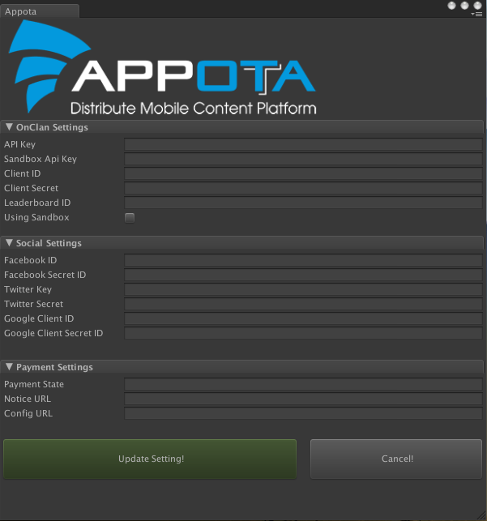
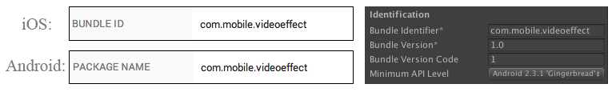

OnClanSDK Unity 
=========

**Các bước tích hợp OnClanSDK**

  - Import SDK vào project
  - Cấu hình SDK
  - Sử dụng SDK

Import SDK
---
Hãy chắc chắn là bạn đã có bản UnityOnClanSDK.unitypackage mới nhất. Sau khi mở Unity, để import package vào project, bạn click chuột phải trong Tab Project và làm theo hướng dẫn bên dưới.

 </br>


Bức ảnh cuối cùng hiển thị cấu trúc thư mục của OnClan SDK. Bạn đã import thành công.

**Lưu ý:** Để có thể sử dụng SDK cho iOS platform, bạn cần đặt toàn bộ frameworks cần thiết vào folder: Assets/Editor/XUPorter/Mods/iOS/Appota/ 

*Danh sách các frameworks*:

Trong folder Frameworks/
> FacebookSDK.framework
>
> GoogleOpenSource.framework
>
> GooglePlus.bundle	
>
> GooglePlus.framework

Checkout repo: https://github.com/appota/ios-onclan-sdk
> OnClanBundle.bundle
>
> OnClanSDK.framework


Cấu hình SDK
---
**Cấu hình OnClan Setting**: Để sử dụng các chức năng của OnClan SDK trước tiên cần vào menu Appota/OnClan Setting để cài đặt các cấu hình ID

 </br>

Cửa sổ Setting được hiện ra, ta cần điền đầy đủ thông tin cấu hình vào từng mục

 </br>

Cấu hình được phân chia làm 2 mục riêng biệt:

#### OnClan Settings

- **Game ID**: id tương ứng với game của nhà phát triển, liên hệ với Appota Game Supporter để nhận key.
- **Api Key**: liên hệ với Appota Game Supporter để nhận được key.
- **Client ID**: liên hệ với Appota Game Supporter để nhận key.

#### Social Settings
- **Facebook ID**: nhận Facebook ID từ việc đăng ký tạo ứng dụng trên trang https://developers.facebook.com/ (liên hệ với Appota Game team để tạo ứng dụng Facebook hoặc bạn có thể tự tạo ứng dụng cho riêng mình theo hướng dẫn của trang developer). 

>  </br>
>
> **Lưu ý:** Cấu hình BundleID(iOS) hay Package Name(Android) được khai báo trên trang Developer phải trùng khớp với Bundle Indentifier trong project Unity.
>
>  </br>

- **Twitter Key**: nhận được khi đăng ký tạo ứng dụng trên trang https://dev.twitter.com/
- **Twitter Secret**: nhận được khi đăng ký tạo ứng dụng trên trang https://dev.twitter.com/

>  </br>
> 
> Để có thể đăng nhập được Twitter, cần cấu hình thêm mục Callback URL
>
>  </br>

- **Google Client ID**: nhận Google Client ID từ việc đăng ký tạo ứng dụng trên trang Developer của Google theo hướng dẫn https://developers.google.com/+/mobile/ios/getting-started (liên hệ với Appota Game team để tạo ứng dụng hoặc bạn có thể tự tạo ứng dụng của riêng mình) 

>  </br>
>
> **Lưu ý:** Cấu hình BundleID(iOS) hay Package Name(Android) được khai báo trên trang Developer phải trùng khớp với Bundle Indentifier trong project Unity.
>
>  </br>

Chọn **Update Settings** sau khi đã hoàn thành các thông số ID.

Sử dụng SDK
---

####Khởi tạo SDK
Trước khi có thể sử dụng các chức năng của SDK, cần gọi hàm khởi tạo để cấu hình ứng dụng:

```c#
public void ConfigureOCSDK();
```
*Cách sử dụng*: Gọi hàm này khi game bắt đầu được khởi tạo, nên đặt trong phương thức Override `Start()` hoặc `Awake()` của Unity và chỉ nên gọi một lần duy nhất trong game.
```c#
OnClanSDKHandler.Instance.ConfigureOCSDK();
```

####Hiện Leaderboard
Hàm hiển thị bảng xếp hạng thành tích (Leaderboard)

```c#
public void ShowLeaderBoard();
```

*Cách sử dụng*: Gọi hàm này khi nhà phát triển cần hiển thị bảng xếp
hạng thành tích trong game.

```c#
OnClanSDKHandler.Instance.ShowLeaderBoard();
```

####Post Score 
Submit điểm lên Leaderboard.

```c#
public void PostScore(int score);
```
*Cách sử dụng*: Sau khi hoàn thành màn chơi, gọi hàm này để submit số điểm của người chơi lên. Server sẽ kiểm tra, nếu cao hơn điểm cũ sẽ thay thế bằng điểm hiện tại..

```c#
OnClanSDKHandler.Instance.PostScore(score);
```

**Callback:** Nhận kết quả trả về từ OnClan SDK và xử lý bằng cách cài đặt phần xử lý kết quả trong thân các hàm trong scripts <code>OnClanSDKReceiver.cs</code>.
```c#
// OnClanSDKReceiver.cs 
public void OnLoginSuccess(string appotaSession)
{
    // @appotaSession trả về là access_token của User
	// Cài đặt phần xử lý
}

public void OnLogoutSuccess()
{ 
	// Cài đặt phần xử lý
}

void OnSwitchAccountSuccess(string appotaSession)
{
    // @appotaSession trả về là access_token của User
	// Cài đặt phần xử lý
}
```

**Cài đặt Icon Game (Android platform only)**

Đối với Android platform, khi nhà phát triển sử dụng thư viện của bên thứ 3, Unity sẽ mặc định lấy icon Android thay thế cho Icon của game. Để tránh điều này, bạn đặt icons game vào trong folder Assets/Plugins/Android/res/drawable-xx 

 </br>

Mỗi folder *drawable* tương ứng với mỗi kích thước, độ phân giải của màn hình. Do vậy cần đặt các icon tương ứng vào các folder. Để biết thêm chi tiết về *drawable* tham khảo: 
http://developer.android.com/guide/practices/screens_support.html#overview
